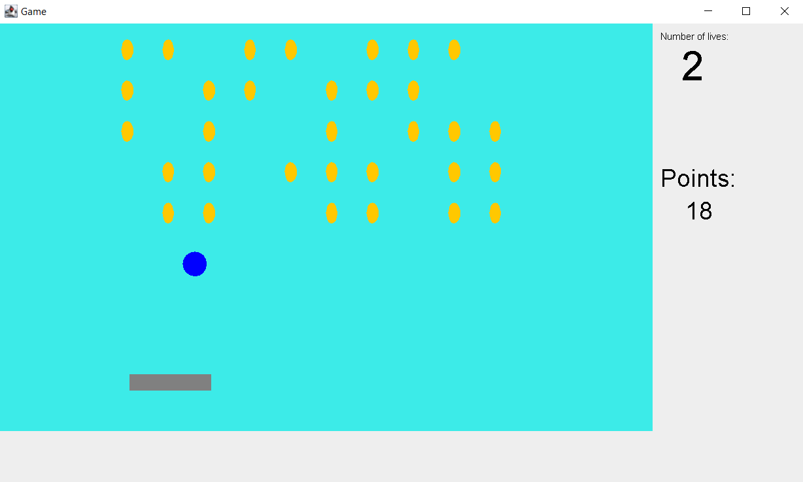

# Palette

## General Information
In the palette game is board there are coins and palette. 
We can collect coins and catch ball with a palette.

## Screenshots
### Board with coins

## Technologies Used
- Java
- Swing
- Maven

## Features
- Board
- Coins and palette
- Amount lifes
- Amount of collected coins

### Functions of game
- collecting coins
- catching (auto) and releasing ball - key: space
- moving the palette to the left and right - key: right and left

## Usage
Run main method in Run class.

## Room for Improvement
- Control panel:
    - editable size ball and coins
    - editable an amount lifes and speed of the ball
    - start, stop and reset buttons
    - game time
- History of top times

